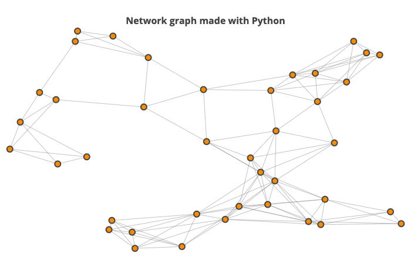
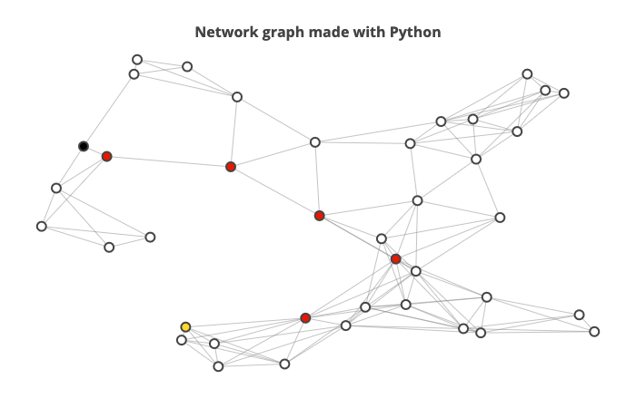

# Map_Route_Planner
Implement A Star Search Algorithm to plan a route on a map and visualize the shortest path between two points.

The main code which implements the A* algorithm is in the a_star_algo.py. The helper.py file is used to create visualization and show the path determined.

The Graph which acts as the map to visualize the different points.

The shortest distance between two points determined using A* algorithm and visualized : 

